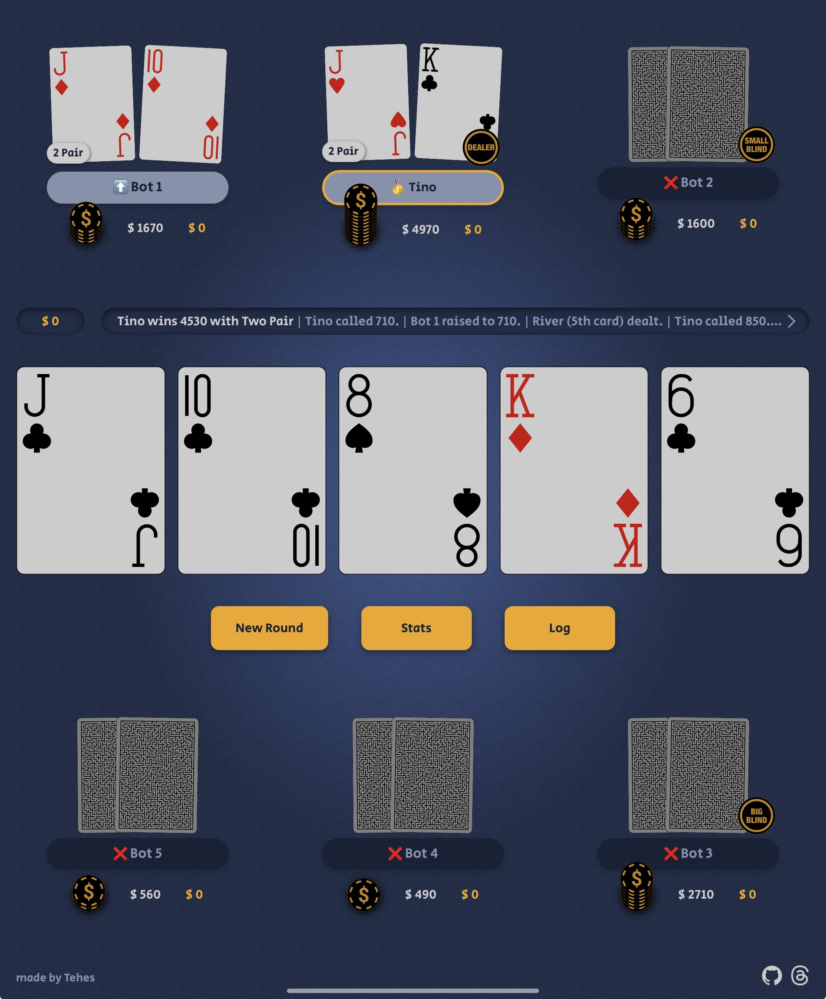

# Digital Poker Table

A browser-based, zero-setup poker table to play Texas Hold'em with friends using only your devices.
Scan a QR code to see your hole cards privately on your phone, while the shared table (e.g., on a
tablet or laptop) handles community cards, blinds, pot, and betting rounds.

---

## 🎯 Key Features

- **No Setup Required**: Just open the table in your browser and start playing. No app install, no
  sign-ups.
- **Device Pairing via QR**: Each player scans a code to privately view their cards on their phone.
- **Automatic Game Logic**: Handles blinds, bets, pots, side pots, and showdown evaluations.
- **Progressive Blinds**: Blinds automatically double every 2 complete dealer orbits to keep the
  action going.
- **Side Pot Support**: Accurately resolves complex all-in scenarios.
- **Dynamic Positioning**: Turn order and bot strategy adapt as players fold.
- **Supports All Table Sizes**: From heads-up to full-ring games.
- **Responsive Design**: Optimized for tablets, phones, and desktops.
- **Smart Bet Slider**: The bet slider highlights invalid amounts in red while dragging and snaps to
  the minimum legal raise when released.
- **Fast & Offline-Ready**: Loads fast, works without internet once cached.
- **Built‑in Bots**: Empty player slots are automatically filled with bots.
- **Bot Intelligence**: Bots evaluate hand strength, pot odds, stack size, and position to make
  informed decisions.
- **Adaptive Behavior**: Bots track how often opponents fold, detect frequent all-ins, and adjust
  their bluffing frequency accordingly.
- **Context Awareness**: Bots recognize top pair, overpairs, and draw potential to decide between
  check, call, raise, or fold.

---

## 🎮 Main Play Modes

The same table supports different ways to play. The "mode" is simply the result of how many humans
join and whether you scan the QR codes.

- **Solo vs Bots (Open Cards)**: One human plays directly on the main device while bots fill the
  empty seats. This is the fastest way to play and learn.
- **Spectator / TV Poker**: No humans join. All seats are bots, hole cards are visible, and the
  table becomes a self-running poker show.
- **Group Play with QR Hole Cards**: Two or more humans join. Each player scans their QR code to see
  private hole cards on their own phone, while the shared screen stays clean and neutral.
- **Hybrid Tables**: Humans and bots can mix freely. This makes it easy to run short-handed games,
  fill gaps, or teach new players without slowing the table down.

---

## 🚀 Getting Started

1. Open this URL on a shared device (e.g., tablet or laptop): 👉
   [https://tehes.github.io/poker](https://tehes.github.io/poker)

2. Add players by typing their names.

3. Start the game — each player scans their QR code to get their cards.

4. The table handles dealing, blinds, betting, and showdown.

---

## 📶 Offline Use

The table works fully offline after the first complete load.

- **First visit online** – When opened once with an internet connection, all necessary assets (HTML,
  JS, CSS, SVGs, icons) are cached in the browser.
- **Service Worker** – Handles cache-first requests and serves offline content when the network is
  unavailable.
- **Core Assets Pre‑cached** – Core assets are precached during install; any additional resources
  are loaded and cached on demand.
- **Updates** – A new version is fetched and activated in the background; refreshing the page loads
  the updated assets.

---

## 🛠️ Tech Stack

- **HTML/CSS/JavaScript** only – no frameworks
- **Vanilla JS Game Engine**
- **kjua** – lightweight QR code generation for offline play
- **pokersolver** (ES module) – for hand evaluation at showdown

---

## 🌐 Optional Backend Sync

- The table generates a `tableId` automatically and posts the table state to the backend.
- Hole-cards views include the same `tableId` in the QR and poll the backend to keep cards/chips in
  sync, including pot and fold status. If the backend is unreachable, the QR data stays in place and
  play continues offline.

---

## 🤖 How It Works

- The shared device runs the table (e.g., tablet).
- When a round starts, each player sees a QR code.
- They scan it and view their private hole cards on their own phone.
- Players take turns acting via the main table.
- Game flow logic ensures proper handling of:

  - **Dealer rotation** and automatic blind posting
  - **Progressive blinds** that double every 2 complete orbits (e.g., 10/20 → 20/40 → 40/80)
  - Side pots and all-ins
  - Automatic showdown resolution
  - **Bot Support**: Empty seats without a player name are assigned bots that play automatically
    using simple hand-strength logic.

---

## Bot Behavior (Tournament Logic)

Bots play tournament-style poker and follow consistent rules (no hidden information or "reads").
In plain terms, they consider:

- **Hand and board**: starting hand strength, made hands, strong pairs, and straight/flush draws,
  plus how dangerous the board is.
- **Risk and price**: the price to call versus the pot, how much of their stack is at risk, and
  whether a bet is all-in.
- **Position and table**: seat position, number of opponents still in the hand, and whether the bot
  was the preflop aggressor (affects continuation and follow-up bets).
- **Opponent tendencies**: how loose/tight and aggressive opponents are, and how often they fold,
  based on enough hands played.
- **Tournament zones (M-ratio)**: stack vs blinds decides whether they shove, raise, call, or fold.
- **Stack context**: chip leaders raise a bit wider, short stacks call tighter; small randomness and
  occasional bluffs appear only outside the shove-only zones.

---

## 🧠 Design Philosophy

- **Local-first**: Works without network once loaded.
- **Optional back-end sync**: Core state is client-side, with best-effort syncing when available.
- **Zero footprint**: No accounts, no cloud sync.
- **Focus on flow**: The app enforces rules and turn order so you can focus on the game.
- **Tournament-style**: Progressive blinds keep games from stalling.

---

## 🐞 Debug Logging

Set `DEBUG_FLOW` to `true` in `js/app.js` to print detailed, timestamped messages about the betting
flow. Enable this flag when investigating hangs or unexpected behavior.

---

## 📋 Known Limitations

- Live syncing is best-effort; if the backend is unreachable, devices fall back to local QR data.
- No persistent chip stacks or session saving (yet).
- Not designed for remote multiplayer.
- Fixed blind structure (doubles every 2 orbits) — not customizable.

---

## 🙌 Credits

- [pokersolver](https://github.com/goldfire/pokersolver) for hand ranking logic
- [kjua](https://github.com/lrsjng/kjua) for QR code generation
