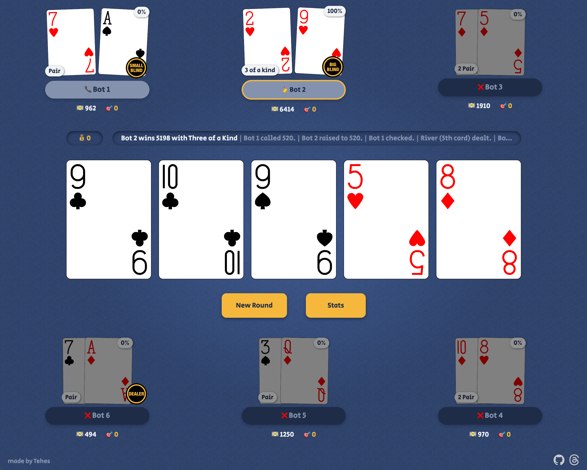

# Digital Poker Table

A browser-based, zero-setup poker table to play Texas Hold'em with friends using only your devices.
Scan a QR code to see your hole cards privately on your phone, while the shared table (e.g., on a
tablet or laptop) handles community cards, blinds, pot, and betting rounds.

---

## 🎯 Key Features

- **No Setup Required**: Just open the table in your browser and start playing. No app install, no sign-ups.
- **Device Pairing via QR**: Each player scans a code to privately view their cards on their phone.
- **Remote Player Actions**: In QR multiplayer games, the active player can fold, check, call, raise, or go all-in directly from their own phone.
- **Automatic Game Logic**: Handles blinds, bets, pots, side pots, and showdown evaluations.
- **Progressive Blinds**: Blinds automatically double every 2 complete dealer orbits to keep the action going.
- **Side Pot Support**: Accurately resolves complex all-in scenarios.
- **Dynamic Positioning**: Turn order and bot strategy adapt as players fold.
- **Supports All Table Sizes**: From heads-up to full-ring games.
- **Responsive Design**: Optimized for tablets, phones, and desktops.
- **Smart Bet Slider**: The bet slider highlights invalid amounts in red while dragging and snaps to
  the minimum legal raise when released.
- **Fast & Offline-Ready**: Loads fast, works without internet once cached.
- **Built‑in Bots**: Empty player slots are automatically filled with bots.
- **Fast Forward for Bot-Only Hands**: When no human can act in the current hand, a Fast Forward button lets you speed through the remaining bot action. If no humans have chips left after that, the game keeps fast-forwarding until a winner remains.
- **Bot Intelligence**: Bots evaluate hand strength, pot odds, stack size, and position to make informed decisions.
- **Adaptive Behavior**: Bots track how often opponents fold, detect frequent all-ins, and adjust their bluffing frequency accordingly.
- **Context Awareness**: Bots recognize top pair, overpairs, and draw potential to decide between check, call, raise, or fold.
- **Postflop Hand Labels**: When hole cards are visible on the table, the shared screen shows short postflop hand categories like Pair, 2 Pair, 3 of a kind, Straight, or Flush.
- **Bot Reveals**: After some uncontested postflop wins, bots may occasionally reveal one or both hole cards to create small TV-poker moments.
- **Session Stats Overlay**: After each completed hand, open a compact stats view with stack, hands won, showdown results, folds, and all-ins for all active players.
- **Winner Reactions**: After a pot win, the shared table may briefly show a face emoji above each main-pot winner. Reactions are based only on public information such as pot size, split pots, all-ins, visible hand strength, reveals, and stack swings.

---

## 🎮 Main Play Modes

The same table supports different ways to play. The "mode" is simply the result of how many humans join and whether you scan the QR codes.

- **Solo vs Bots (Open Cards)**: One human plays directly on the main device while bots fill the empty seats. This is the fastest way to play and learn.
- **Spectator / TV Poker**: No humans join. All seats are bots, hole cards are visible, and the table becomes a self-running poker show.
- **Group Play with QR Hole Cards**: Two or more humans join. Each player scans their QR code to see private hole cards on their own phone, while the shared screen stays clean and neutral. When it is their turn, they can also act directly from their own device.
- **Hybrid Tables**: Humans and bots can mix freely. This makes it easy to run short-handed games, fill gaps, or teach new players without slowing the table down.

---

## 🚀 Getting Started

1. Open this URL on a shared device (e.g., tablet or laptop): 👉
   [https://tehes.github.io/poker](https://tehes.github.io/poker)

2. Add players by typing their names.

3. Start the game — each player scans their QR code to get their cards.

4. The table handles dealing, blinds, betting, and showdown.

   In QR multiplayer, the active player can also act directly from their own phone. Solo and spectator modes stay on the shared device and do not require QR scans.

---

## 📶 Offline Use

The table works fully offline after the first complete load.

- **First visit online** – When opened once with an internet connection, all necessary assets (HTML, JS, CSS, SVGs, icons) are cached in the browser.
- **Service Worker** – Handles cache-first requests and serves offline content when the network is unavailable.
- **Core Assets Pre‑cached** – Core assets are precached during install; any additional resources are loaded and cached on demand.
- **Updates** – A new version is fetched and activated in the background; refreshing the page loads the updated assets.

---

## 🛠️ Tech Stack

- **HTML/CSS/JavaScript** only – no frameworks
- **Vanilla JS Game Engine**
- **kjua** – lightweight QR code generation for offline play
- **pokersolver** (ES module) – for hand evaluation at showdown

---

## 🌐 Optional Backend Sync

- Backend sync is enabled only for QR multiplayer games that start with at least 2 human players.
- In solo and spectator games, the table keeps a clean URL without `tableId` and stays fully local.
- When sync is active, hole-cards views include the same `tableId` in the QR and poll the backend to keep cards/chips in sync, including pot and fold status. The backend also relays turn-based action requests from the phone back to the shared table. If the backend is unreachable, the QR data stays in place and play continues offline.

---

## 🤖 How It Works

- The shared device runs the table (e.g., tablet).
- When a round starts, each player sees a QR code.
- They scan it and view their private hole cards on their own phone.
- In solo play, the human acts on the shared device.
- In QR multiplayer, the active player can act on the shared device or directly on their own phone.
- Game flow logic ensures proper handling of:

  - **Dealer rotation** and automatic blind posting
  - **Progressive blinds** that double every 2 complete orbits (e.g., 10/20 → 20/40 → 40/80)
  - Side pots and all-ins
  - Automatic showdown resolution
  - **Bot Support**: Empty seats without a player name are assigned bots that play automatically
    using simple hand-strength logic.

---

## Bot Behavior (Tournament Logic)

Bots play tournament-style poker and follow consistent rules (no hidden information or "reads"). In
plain terms, they consider:

- **Hand evaluation**: preflop strength uses a simplified Chen score; postflop uses pokersolver rank plus kicker tiebreakers and checks whether hole cards actually improve the hand.
- **Board context**: recognizes top pair/overpair, straight/flush draws (outs to equity), and board texture (dry vs wet) to adjust strength.
- **Tournament zones (M-ratio)**: dead/red/orange/yellow/green zones guide preflop Harrington-style push/call/raise logic; green zone plays chip-EV.
- **Stack pressure and risk**: pot odds, stack ratio, and SPR; shallow SPR or <=10bb can trigger shove thresholds; large all-in calls are tightened by an elimination-risk guardrail.
- **Commitment control**: invested-stack and remaining-street pressure add a call penalty to reduce multi-street bleeding while still calling when committed.
- **Position and table**: position factor and active opponents shift aggression and raise thresholds; chip leaders open wider, short stacks call tighter and cap non-premium bet sizes.
- **Opponent tendencies**: VPIP, aggression, and fold rate are weighted only after enough hands; fold-heavy tables increase bluff frequency.
- **Bet sizing**: value/protection/bluff/overbet sizes scale with pot, texture, SPR, position, and opponent count, with small randomness and rounding.
- **Line memory and tie-breakers**: tracks the preflop aggressor for c-bet/barrel plans (aborts on very wet boards); near-threshold decisions randomize between close actions and avoid bluffing into all-ins.
- **Raise constraints**: respects per-round raise limits and minimum-legal raises, and can downgrade a raise to a call/check if the minimum is not met.
- **All-in response**: avoids automatic folds against all-ins by allowing risk-aware calls with sufficiently strong hands.
- **Postflop pressure filters**: distinguishes made hands, strong draws, weak draws, and dead hands to tighten or loosen calling on later streets.
- **Occasional deception**: mixes in stabs, check-backs, and overbets to avoid being predictable.

---

## 🧠 Design Philosophy

- **Local-first**: Works without network once loaded.
- **Optional back-end sync**: Core state is client-side, with best-effort syncing when available.
- **Zero footprint**: No accounts, no cloud sync.
- **Focus on flow**: The app enforces rules and turn order so you can focus on the game.
- **Tournament-style**: Progressive blinds keep games from stalling.

---

## 🐞 Debug Logging

Set `DEBUG_FLOW` to `true` in `js/app.js` to print detailed, timestamped messages about the betting flow. Enable this flag when investigating hangs or unexpected behavior.

---

## 📋 Known Limitations

- Live syncing is best-effort; if the backend is unreachable, devices fall back to local QR data.
- Without active sync or without `tableId`, the hole-cards view is read-only and actions stay on the shared device.
- No persistent chip stacks or session saving (yet).
- Not designed for remote multiplayer.
- Fixed blind structure (doubles every 2 orbits) — not customizable.

---

## 🙌 Credits

- [pokersolver](https://github.com/goldfire/pokersolver) for hand ranking logic
- [kjua](https://github.com/lrsjng/kjua) for QR code generation
